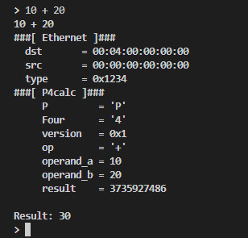
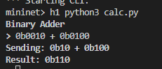
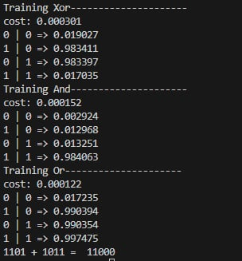

# P4 Binary Adder

This repository contains the implementation of a simple P4 program that acts as a binary adder. The setup includes Mininet for network emulation and Scapy for packet crafting and sending.

## Requirements

- Mininet
- P4C (P4 Compiler)
- Scapy
- Python 3

## Installation

### 1. Install Python Libraries

Install the necessary Python libraries using pip:

pip install scapy p4utils

### Files
- calc.p4: The P4 program that implements the binary adder.
- p4app.json: Configuration file for the P4 application.
- network.py: Python script to set up the Mininet network.
- calc.py: Python script to send packets using Scapy.

# Usage

## Step 1: Clean Up Previous Mininet Instances
Ensure no previous Mininet instances are running:

sudo mn -c  

## Step 2: Start the Mininet Network
Run the network.py script to set up the Mininet network:

sudo python3 network.py

## Step 3: Verify Network Interfaces
In the Mininet CLI, verify the network interfaces for h1 and s1:
 
mininet> h1 ifconfig -a  
mininet> s1 ifconfig -a 

## Step 4: Update Interface in calc.py  
Update the calc.py script with the correct network interface for h1:

### In calc.py
iface = 'h1-eth0'  # Replace with the correct interface name

## Step 5: Run calc.py
Run the calc.py script to send packets and get results:

sudo python3 calc.py

## Step 6: Capture Packets with tcpdump (Optional)
You can use tcpdump to capture and inspect packets on the correct interface:

sudo tcpdump -i h1-eth0

## Example

\>10 + 20  
30

### Decimal numbers

\>0b0100 + 0b0010
0b110

### Binary numbers

# Notes
Ensure that the P4 program (calc.p4) is correctly compiled and loaded into the switch.  
Use pkt.show() in calc.py to debug and inspect packet structures.  
Use the Mininet CLI for further debugging and inspection of the network setup.  

# Proof of concept

See the BinaryNNAdder.c file in the repository.    

